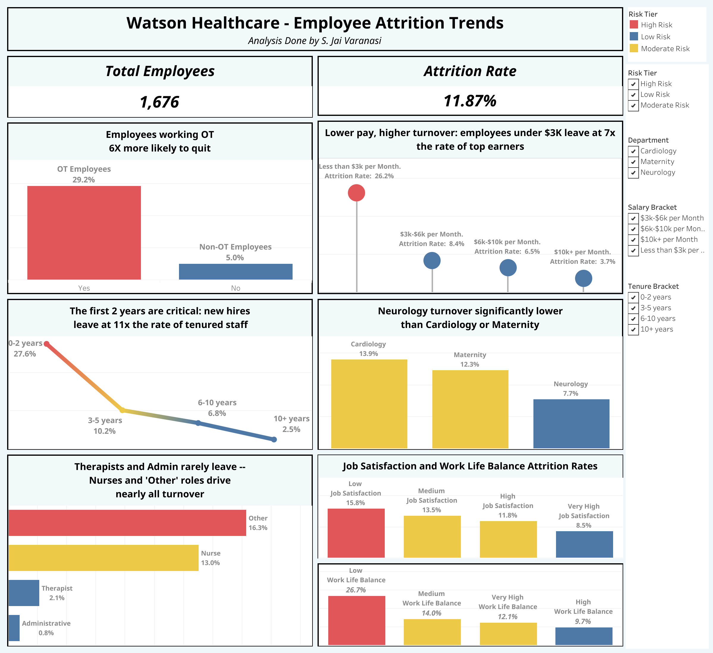

# Watson Healthcare Employee Attrition Analysis

An end-to-end data analysis project identifying the key drivers behind employee attrition at a healthcare organization — from data cleaning in Python, to SQL analysis across 16 business questions, to an interactive Tableau dashboard and executive presentation.

**[View the Tableau Dashboard](https://public.tableau.com/views/WatsonHealthcareEmployeeAttritionTrends/AttritionDashboard?:language=en-US&:sid=&:redirect=auth&:display_count=n&:origin=viz_share_link)** | **[Watch the Video Walkthrough](YOUR_LOOM_LINK_HERE)** | **[View the Presentation](presentation/Watson_Healthcare_Attrition_Presentation.pptx)**

---

## Business Problem

A healthcare organization is experiencing high attrition rates and varying levels of employee satisfaction across departments. With **199 out of 1,676 employees leaving (11.87% attrition rate)**, leadership needs to understand what's driving departures and where to focus retention efforts for maximum impact.

## Tools & Technologies

- **Python** (Pandas) — Data cleaning, exploration, and feature engineering
- **SQL** (MySQL) — Querying and analyzing the cleaned dataset
- **Tableau** — Interactive dashboard and data visualization
- **DBeaver** — Database client for SQL development

## Project Structure

```
├── README.md
├── data/
│   ├── watson_healthcare_original.csv         # Raw dataset
│   └── watson_healthcare_cleaned.csv          # Cleaned dataset
├── notebooks/
│   └── Watson_Healthcare_Data_Cleaning.ipynb  # Python cleaning notebook
├── sql/
│   └── watson_healthcare_analysis.sql         # Full SQL analysis (16 questions)
├── presentation/
│   └── Watson_Healthcare_Attrition_Presentation.pptx
└── images/
    └── dashboard_preview.png                  # Tableau dashboard screenshot
```

## Workflow

1. **Data Cleaning (Python):** Loaded raw CSV, checked for nulls/duplicates/outliers, standardized job role values (merged "Admin" into "Administrative"), mapped numeric codes to readable labels (Education, Satisfaction, Work-Life Balance), created analytical groupings (age, salary, tenure, and distance brackets).

2. **Analysis (SQL):** Imported cleaned dataset into MySQL, wrote queries to answer 16 business questions covering attrition rates by department, age, gender, education, job role, satisfaction, distance, work-life balance, performance, salary, tenure, promotions, training, career development, and overtime.

3. **Visualization (Tableau):** Built an interactive dashboard highlighting the most impactful attrition drivers with filterable views by department, role, and demographic.

## Dashboard Preview



**[Explore the full interactive dashboard on Tableau Public →](https://public.tableau.com/views/WatsonHealthcareEmployeeAttritionTrends/AttritionDashboard?:language=en-US&:sid=&:redirect=auth&:display_count=n&:origin=viz_share_link)**

## Key Findings

### The Single Biggest Driver: Overtime
Employees who work overtime leave at **29.2%** compared to **5.0%** for non-overtime workers — a nearly **6x difference**. This creates a vicious cycle in healthcare: understaffing leads to overtime, which causes burnout, which causes more departures, which creates more understaffing.

### Top 5 Attrition Factors (Ranked by Impact)

| Factor | Attrition Rate | Comparison |
|--------|---------------|------------|
| Overtime (Yes) | 29.2% | vs 5.0% (No) |
| Low tenure (0-2 years) | 27.65% | vs 2.46% (10+ years) |
| Poor work-life balance (Rating 1) | 26.67% | vs 9.73% (Rating 3) |
| Low salary (Under $3K/month) | 26.23% | vs 3.69% ($10K+) |
| Young age (avg 31) | Higher risk | vs avg 38 for stayers |

### Additional Insights

- **Department:** Cardiology has the highest attrition at 13.94%, nearly double Neurology (7.74%)
- **Job Role:** Nurses (13.02%) and "Other" roles (16.29%) account for the vast majority of departures
- **Commute:** Employees living 21+ miles away leave at 19.75% vs 9.29% for nearby employees
- **Training:** Employees with zero training leave at 21.31%; even one session drops it to 5.95%
- **Satisfaction:** Clear inverse relationship — lowest satisfaction (15.81%) vs highest (8.49%)
- **Performance Ratings:** Not a predictor — only two levels exist (3 and 4) with nearly identical attrition rates, suggesting the evaluation system needs improvement

### Profile of an At-Risk Employee

Young (~31 years old), low-paid (avg $4,024/month), new to the company (avg 3.7 years), working overtime, with poor work-life balance, living far from work. Most likely a Nurse or "Other" role in Cardiology or Maternity.

## Recommendations

1. **Reduce mandatory overtime** — Hire additional staff to break the understaffing-overtime-burnout cycle, especially in Cardiology and Maternity
2. **Increase entry-level compensation** — Target employees earning under $3K/month where attrition is 26%
3. **Strengthen the first 2 years** — Implement structured mentorship, 30-60-90 day check-ins, and buddy systems to address the 27.65% early attrition rate
4. **Improve work-life balance** — Offer flexible scheduling and predictable shift rotations
5. **Create nurse-specific retention programs** — Career ladders, specialty training, and retention bonuses for the largest at-risk population
6. **Ensure all employees receive training** — Zero-training employees leave at 4x the rate of trained ones
7. **Offer remote/flexible options** — For non-patient-facing roles to address the commute-distance factor

## Data Cleaning Summary

- No nulls or duplicates found
- Merged "Admin" into "Administrative" (16 rows consolidated)
- No outliers detected
- Added 8 derived columns: EducationLevel, JobSatisfactionLevel, EnvironmentSatisfactionLevel, WorkLifeBalanceLevel, AgeBracket, SalaryBracket, TenureBracket, DistanceBracket
- Final dataset: 1,676 rows, 43 columns

## Author

**Jai Varanasi** | [LinkedIn](https://www.linkedin.com/in/s-jai-varanasi-0b651037b/) | [InsightArc Analytics](https://www.linkedin.com/company/insightarc-analytics/)
